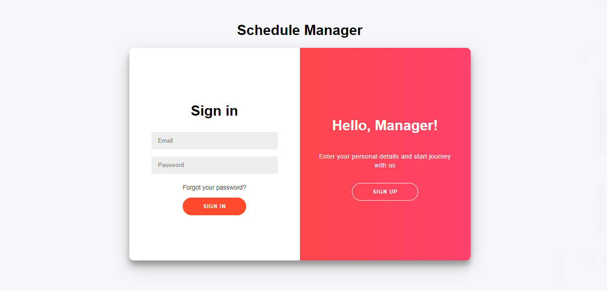
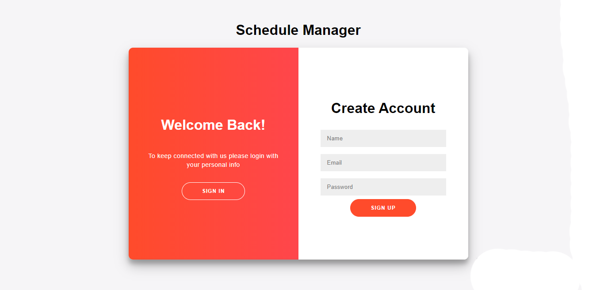
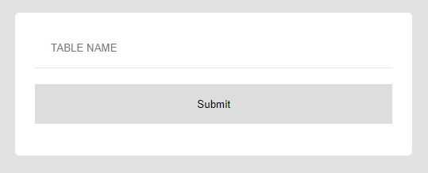
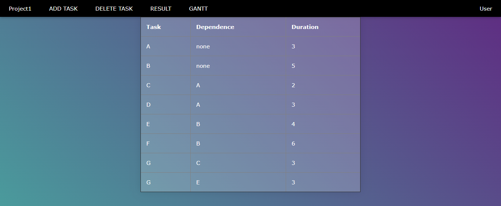
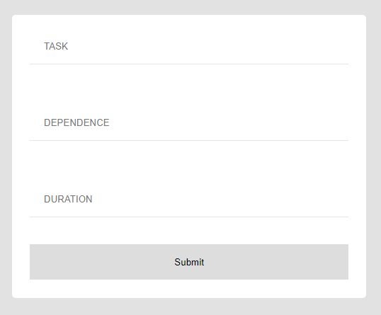
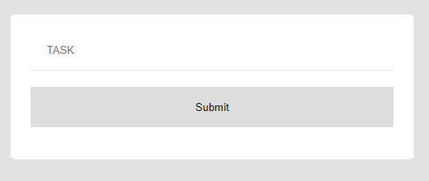
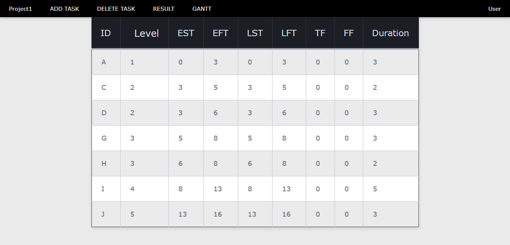
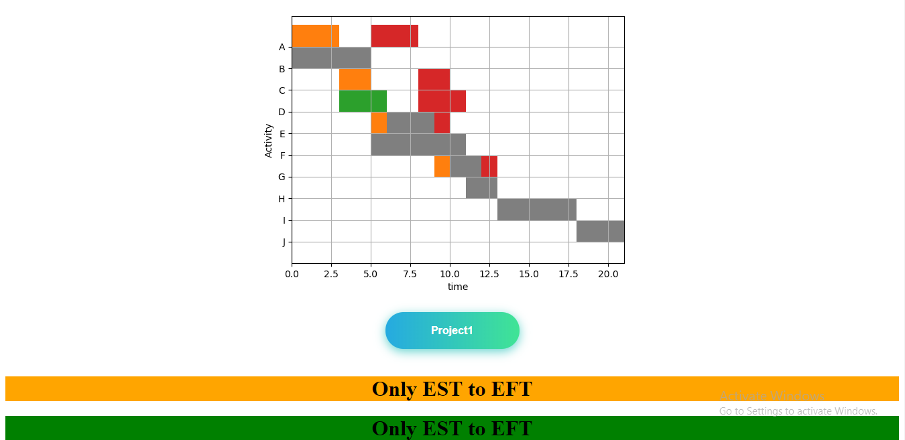
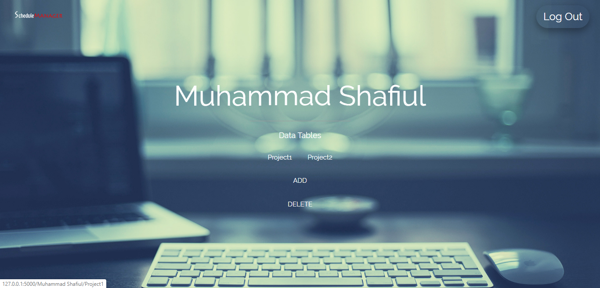

# Schedule_Manager
ERP based web-application in Python using Flask

Schedule Manager is based on the concept of ***network diagram of project management*** . It represents all of the tasks, responsibilities and work-flow for a project by data-table and ***gantt chart***. 

## References:

 - [Network Diagram](https://www.inloox.com/project-management-glossary/project-network-diagram/)

 - [Gantt chart](https://en.wikipedia.org/wiki/Gantt_chart)

 - [See more](https://en.wikipedia.org/wiki/Critical_path_method)

## Purpose:
 - Planning and tracking project from beginning to end.
 - Calculating the total duration of project. 
 - Find out critical tasks (where, Total Float = Free Float = 0 ) 

## Platform:
 Web App

## Requirements:
- Python
- MySQL Server

## Intallation Steps:
 1. __Database Configuration__:

 	Fill up the Schedule_Manager/db.yaml file
 2. __Mail Configuration__:

 	Set __'MAIL_USERNAME'__ and __'MAIL_PASSWORD'__ at 18 , 19 lines of Schedule_Manager/main.py
 3. __Python Packages__:

 	Download python packages
 	```
	pip install -r requirements.txt
	```
 4. __Run App__:

 	To run application locally:
 	```
	python manage.py start
	```
## Visual Representation:
 At first type the url -  http:/localhost:8000 to visit the site. 
 User will see the __'Sign In'__ page of the app. 



  User must have to __sign up__ before



 __Profile page__ 

 __ADD:__ to add a data-table 

 __DELETE:__ to delete a data-table

 Click a project name to view the data-table


 __ADD__/__DELETE__ data-table




 __View Data-Table__




 __Add Task__

 If there have no dependence type "none"




 __Delete Task__




 __Result View__
 - EST - Early Start Time
 - EFT - Early Finish Time
 - LST - Last Start Time
 - LFT - Last Finish Time
 - TF - Total Float
 - FF - Free Float




 __Gantt Chart__




 Finally __Log Out__

